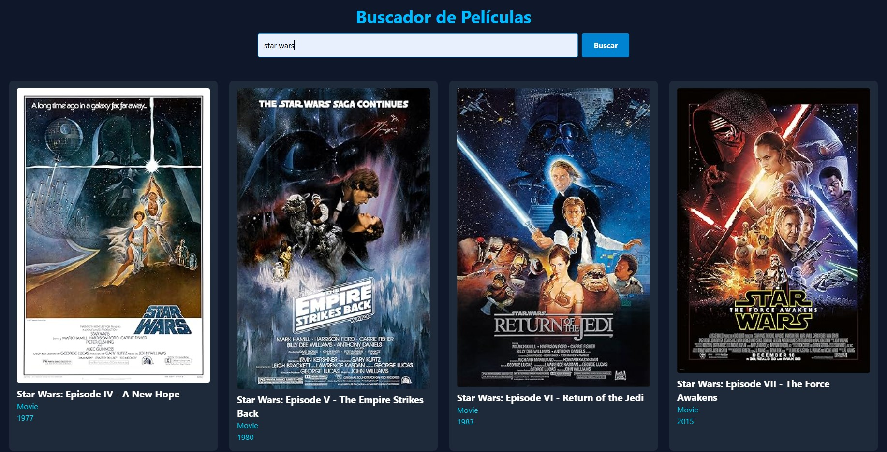

# 🎬 Buscador de Películas (OMDb API)

Proyecto de práctica para el aprendizaje de **JavaScript Moderno (ES6+)**, integrando una API externa y aplicando estilos con **Tailwind CSS v4** sobre un entorno de desarrollo con **Vite**.

## 🚀 Características

* **Búsqueda Dinámica:** Consulta de películas por título a través de la OMDb API.
* **Manejo de Asincronía:** Uso de `async/await` para gestionar peticiones al servidor.
* **Robustez (Error Handling):** Implementación de bloques `try...catch` para evitar fallos si la conexión falla.
* **UX Optimizada:** Permite realizar búsquedas haciendo clic en el botón o presionando la tecla **Enter**.
* **Responsive Design:** Interfaz adaptada a dispositivos móviles y escritorio usando Tailwind.

## 🛠️ Tecnologías Utilizadas

* **Vite:** Entorno de desarrollo y empaquetador.
* **JavaScript Moderno:** Manipulación del DOM, Template Literals y ES Modules.
* **Tailwind CSS v4:** Configurado como plugin de Vite.
* **OMDb API:** Fuente de datos de cine.


## 📦 Instalación

Sigue estos pasos para ejecutar el proyecto localmente:

1. **Clonar el repositorio:**
```bash
git clone https://github.com/diegodelagua/buscador-peliculas.git
```

2. **Instalar dependencias necesarias:**
``` bash
npm install
```

3. **Lanzar el proyecto en modo desarrollo:**
``` bash
npm run dev
```

📂 Estructura del Código
index.html: Estructura base cargada como type="module".

src/main.js: Lógica central, peticiones fetch y renderizado de tarjetas.

src/style.css: Entrada de Tailwind v4 (@import "tailwindcss";).

vite.config.js: Configuración de Vite para procesar el plugin de Tailwind.



